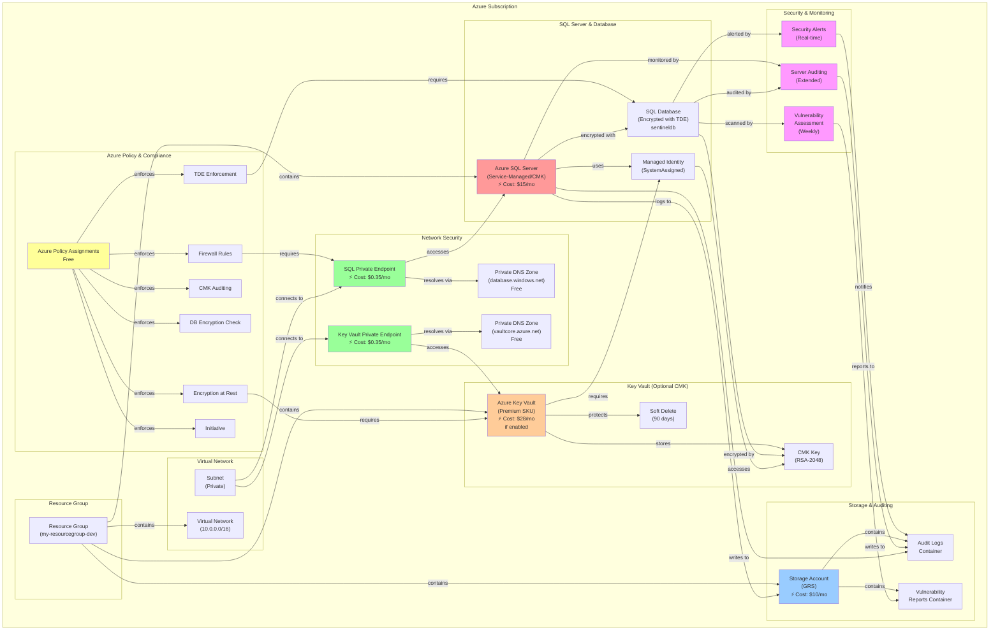
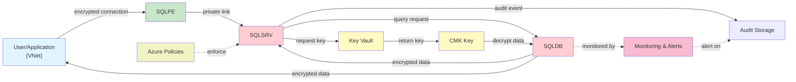
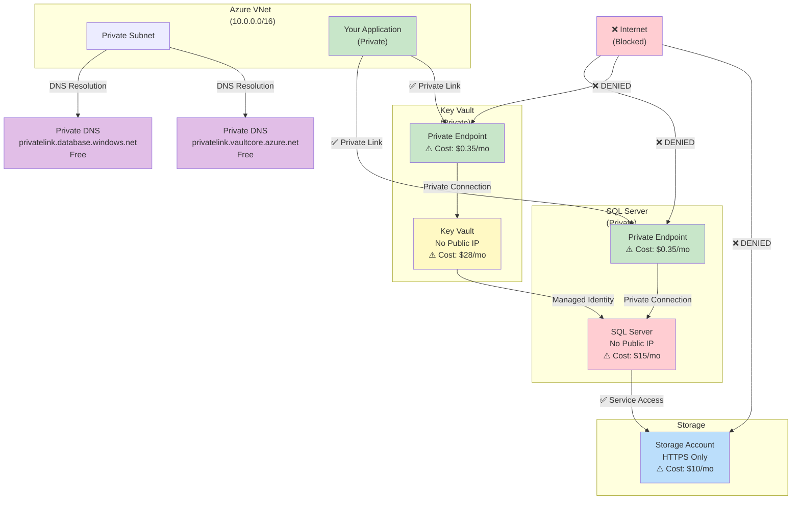
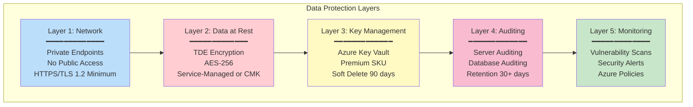
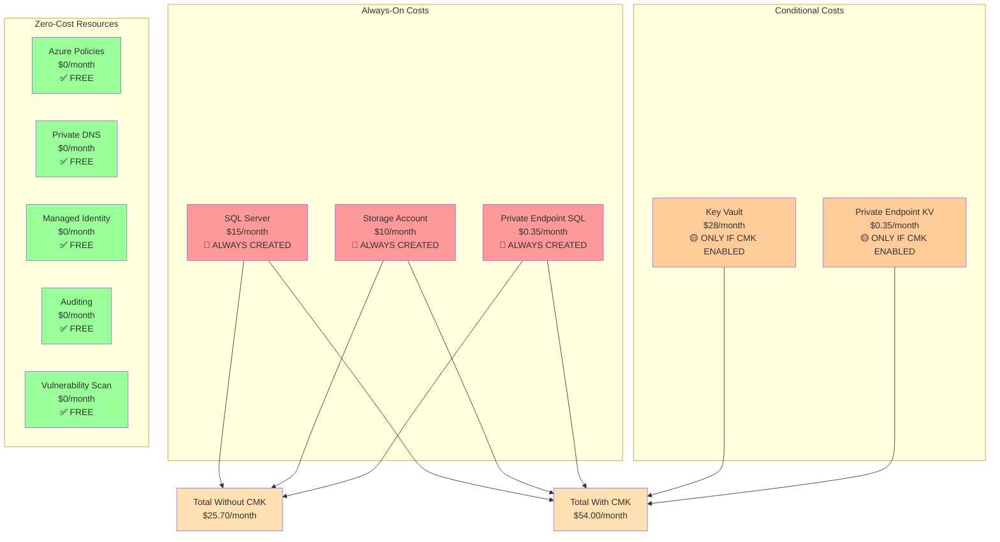
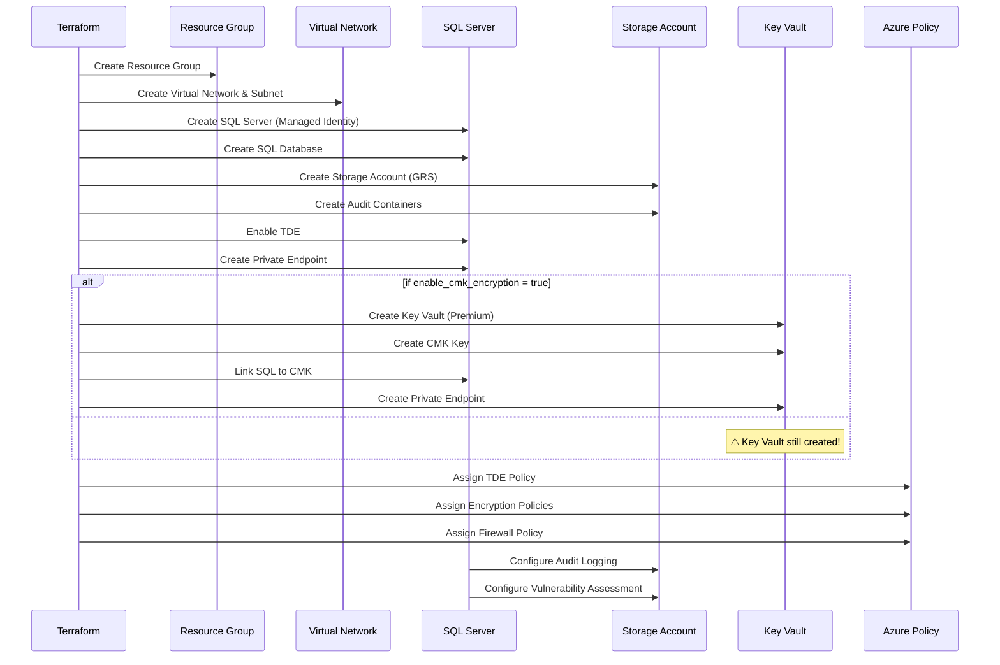

# Azure SQL Server Encryption & Compliance Architecture Diagram

## Complete Resource Architecture



---

## Data Flow Diagram



---

## Network Isolation Architecture



---

## Encryption Layers



---

## Cost Analysis: Resource Dependencies



---

## Deployment Sequence



---

## How to View These Diagrams

### Option 1: GitHub (Automatically Renders)
If you push this file to GitHub, Mermaid diagrams render automatically in the README.

### Option 2: Online Editor
Paste any diagram code into: https://mermaid.live

### Option 3: VS Code Extension
Install "Markdown Preview Mermaid Support" extension:
- Cmd: `ext install markdown-mermaid`
- View in preview pane (Ctrl+Shift+V)

### Option 4: Convert to PNG/SVG
```bash
npm install -g mermaid-cli
mmdc -i ARCHITECTURE_DIAGRAM.md -o architecture.png
```

---

## Resource Summary Table

| Resource | Type | Cost/Month | Always Created? | Purpose |
|----------|------|-----------|---|---------|
| SQL Server | azurerm_mssql_server | $15 | ✅ Yes | Database engine |
| SQL Database | azurerm_mssql_database | Included | ✅ Yes | Data storage |
| Storage Account | azurerm_storage_account | $10 | ✅ Yes | Audit logs, reports |
| Key Vault | azurerm_key_vault | $28 | 🟡 CMK only | CMK storage |
| Private Endpoint (SQL) | azurerm_private_endpoint | $0.35 | ✅ Yes | Secure SQL access |
| Private Endpoint (KV) | azurerm_private_endpoint | $0.35 | 🟡 CMK only | Secure KV access |
| Private DNS Zone (SQL) | azurerm_private_dns_zone | FREE | ✅ Yes | DNS resolution |
| Private DNS Zone (KV) | azurerm_private_dns_zone | FREE | 🟡 CMK only | DNS resolution |
| Managed Identity | SystemAssigned | FREE | ✅ Yes | SQL authentication |
| Azure Policies | subscription_policy_assignment | FREE | ✅ Yes | Compliance enforcement |
| Auditing | extended_auditing_policy | FREE | ✅ Yes | Logging |
| Vulnerability Assessment | vulnerability_assessment | FREE | ✅ Yes | Security scans |
| Security Alerts | (via auditing) | FREE | ✅ Yes | Threat detection |

---

## Key Insights

### 🔴 Cost Reality Check
- **Minimum Cost**: $25.70/month (without CMK)
- **Full Cost**: $54.00/month (with CMK)
- **These costs are ALWAYS charged**, even if resources sit idle

### 🟡 Key Vault Problem
- **Always created** even when `enable_cmk_encryption = false`
- **Charges $28/month** whether used or not
- **Solution**: Wrap Key Vault in a conditional (`count` variable)

### ✅ No Hidden Costs
- Azure Policies: Free
- Private DNS: Free  
- Managed Identity: Free
- Auditing: Free
- Vulnerability Scans: Free

### 🎯 Optimization Recommendations
1. **For non-production**: Skip CMK (`enable_cmk_encryption = false`)
2. **For development**: Destroy when not in use
3. **For production**: Accept the cost for compliance

