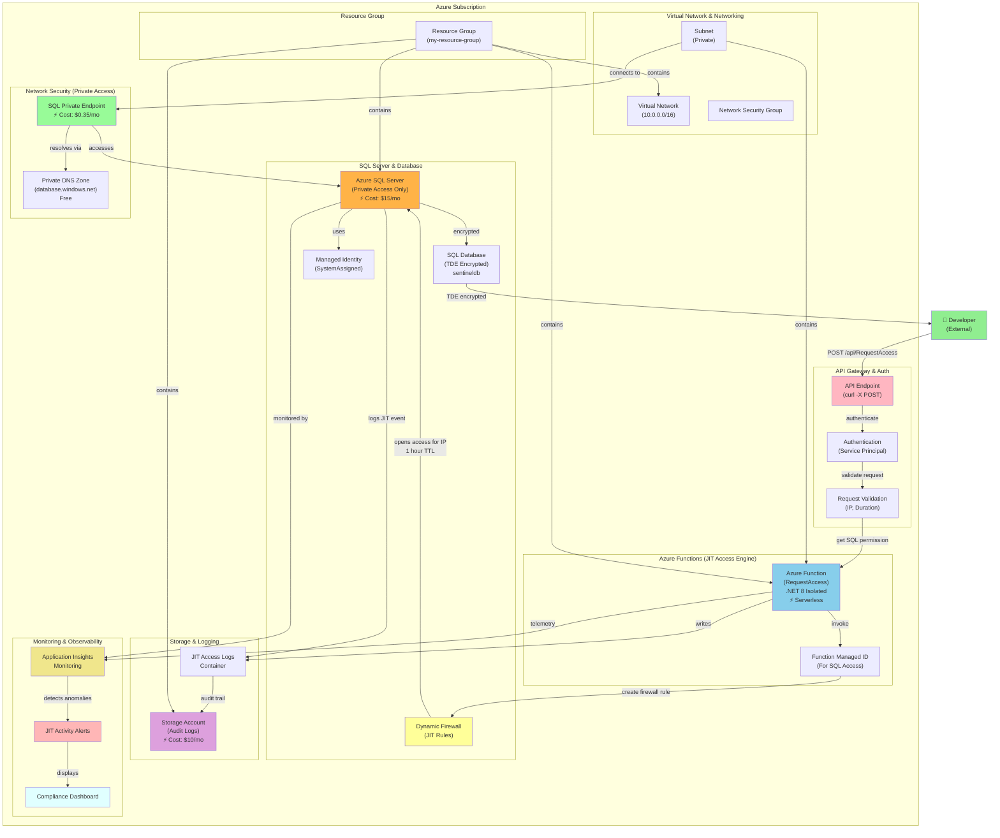
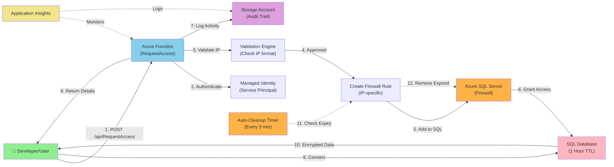
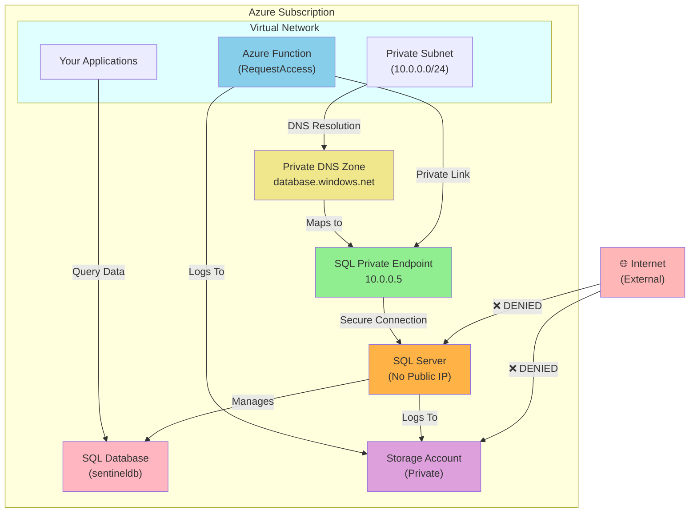

# Azure JIT Access System - Architecture Diagram

## Complete Resource Architecture



---

## Data Flow Diagram (JIT Access Request)



---

## JIT Access Workflow

```
┌─────────────────────────────────────────────────────────────────┐
│                    JIT ACCESS REQUEST FLOW                      │
└─────────────────────────────────────────────────────────────────┘

Step 1: User Request
├─ User runs: curl -X POST https://DOMAIN/api/RequestAccess \
│             -d '{"ip": "YOUR_IP_ADDRESS"}'
└─ Function triggered via HTTP

Step 2: Authentication & Validation
├─ Verify Azure service principal identity
├─ Validate IP format (ipv4)
├─ Check authorization level
└─ Set 1-hour expiration window

Step 3: Create Firewall Rule
├─ Generate unique rule name: JIT_{GUID}_{TIMESTAMP}
├─ Add rule to SQL Server firewall
├─ Rule allows access from User's IP only
└─ All other IPs still blocked

Step 4: Grant Database Access
├─ User's IP can now connect to SQL Server
├─ Connection uses TDE encryption
├─ Data is encrypted in transit (HTTPS/TLS)
└─ Activity logged to storage

Step 5: Automatic Cleanup
├─ Timer checks firewall rules every 5 minutes
├─ Identifies rules with expired TTL
├─ Removes expired rules automatically
└─ User access revoked

Step 6: Audit & Monitoring
├─ All requests logged to storage account
├─ Application Insights tracks metrics
├─ Alerts on suspicious activity
└─ Compliance dashboard updated
```

---

## Zero Trust Security Architecture

```
┌──────────────────────────────────────────────────────────┐
│            ZERO TRUST SECURITY PRINCIPLES                │
└──────────────────────────────────────────────────────────┘

Principle 1: Verify Identity
├─ Service Principal Authentication
├─ Azure AD Integration
└─ Managed Identity for Function

Principle 2: Least Privilege Access
├─ Private Endpoint (No Public Access)
├─ IP-Specific Firewall Rules
├─ 1-Hour Access Window
└─ Automatic Revocation

Principle 3: Protect Data
├─ Transparent Data Encryption (TDE)
├─ Encryption in Transit (HTTPS/TLS 1.2)
└─ GRS Storage for Audit Logs

Principle 4: Monitor & Detect
├─ Real-time Activity Logging
├─ Application Insights Telemetry
├─ Anomaly Detection
└─ Compliance Alerts

Principle 5: Assume Breach
├─ All Actions Audited
├─ Immutable Audit Trail
├─ User IP Recorded
└─ Automatic Revocation
```

---

## Network Architecture (Private Access)



---

## Cost Breakdown

| Component | Cost/Month | Purpose |
|-----------|-----------|---------|
| Azure SQL Server | $15 | Database engine (serverless) |
| Azure SQL Database | ~$10 | Data storage (included) |
| Azure Function | $0-5 | JIT logic (consumption plan) |
| Storage Account | $5 | Audit logs (minimal storage) |
| Private Endpoint | $0.35 | SQL secure access |
| **Total Monthly** | **~$30-35** | Full JIT system |

---

## Key Components Summary

### 1. **Azure Function (RequestAccess)**
- **Language**: C# .NET 8 (Isolated)
- **Trigger**: HTTP POST
- **Purpose**: Accept JIT access requests and create firewall rules
- **Identity**: Managed Identity for SQL Server access
- **Cost**: Serverless (pay per invocation)

### 2. **Azure SQL Server**
- **Access**: Private endpoint only (no public access)
- **Encryption**: Transparent Data Encryption (TDE)
- **Firewall**: Dynamic rules managed by Function
- **Default State**: All access denied
- **Cost**: $15/month (serverless compute)

### 3. **Azure SQL Database**
- **Name**: sentineldb
- **Encryption**: TDE encrypted at rest
- **Storage**: GRS (Geo-Redundant)
- **Backup**: Automatic daily snapshots
- **Cost**: Included with SQL Server

### 4. **Storage Account**
- **Purpose**: Audit logs and compliance records
- **Access**: Private (no public access)
- **Containers**:
  - `jit-access-logs`: Request history
  - `audit-logs`: Activity records
- **Cost**: $5-10/month

### 5. **Application Insights**
- **Monitoring**: Function execution metrics
- **Alerts**: Suspicious activity detection
- **Dashboard**: Real-time visibility
- **Cost**: Included in Function cost

### 6. **Managed Identity**
- **Type**: System-Assigned (built-in)
- **Purpose**: Secure authentication to SQL Server
- **RBAC**: Fine-grained access control
- **Cost**: FREE

---

## How to Use This Diagram

### In GitHub
Mermaid diagrams render automatically in GitHub markdown files.

### In VS Code
1. Install: "Markdown Preview Mermaid Support"
2. Open preview: `Ctrl+Shift+V`
3. View rendered diagrams

### Online
Paste any mermaid code at: https://mermaid.live

---

## Deployment Order

```
1. Create Resource Group
2. Create Virtual Network & Subnet
3. Create Managed Identity
4. Create SQL Server (with Managed Identity)
5. Create SQL Database
6. Create Private Endpoint (SQL)
7. Create Private DNS Zone
8. Create Storage Account
9. Configure Auditing
10. Deploy Azure Function
11. Create Function Managed Identity
12. Grant Function permissions to SQL
13. Configure Application Insights
14. Deploy monitoring alerts
```

