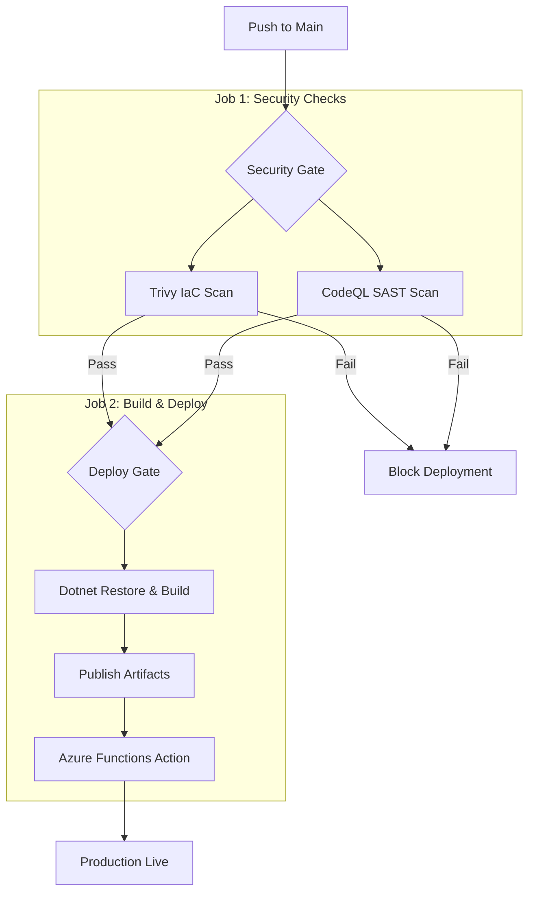

# Deployment Guide: CI/CD Pipeline

## The "Shift-Left" Strategy
This project uses a secure CI/CD pipeline that integrates security scanning *before* the deployment step. If a vulnerability is found, the build fails immediately.

### Pipeline Flow


# 🚀 Deployment & Pipeline Setup

This guide details how to configure the GitHub Actions pipeline, manage secrets, and handle security exceptions for the JIT Access System.

## 1. GitHub Secrets Configuration
To enable the CI/CD pipeline to interact with Azure, you must configure the following secrets in your GitHub Repository settings (`Settings` -> `Secrets and variables` -> `Actions`).

| Secret Name | Description | Required Value Format |
| :--- | :--- | :--- |
| **`AZURE_CREDENTIALS`** | The Service Principal JSON used for authentication. | See JSON Example below |
| **`AZURE_FUNCTIONAPP_NAME`** | The specific name of your Function App in Azure. | e.g., `func-jit-access-dev-xyz` |

### How to generate `AZURE_CREDENTIALS`
Run this command in the Azure CLI (Cloud Shell or Terminal) to generate the JSON:

```bash
az ad sp create-for-rbac --name "github-jit-action" --role contributor \
    --scopes /subscriptions/{YOUR-SUBSCRIPTION-ID} \
    --sdk-auth